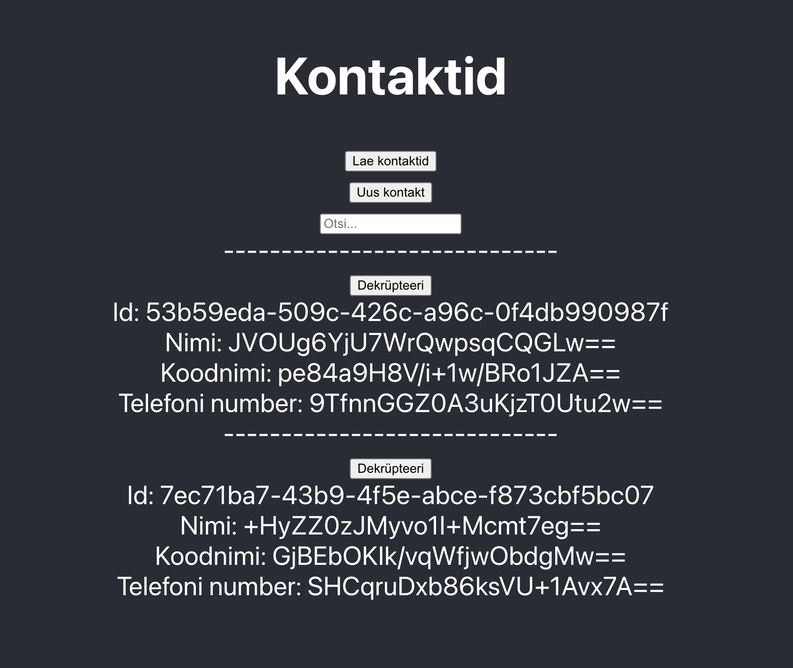

# Contacts test

This is a minimalistic Information system to store contact information securely in a Postgres database. 
Contact information is created on the frontend (browser), encrypted and passed to the backend via REST API to store it in database.
Contacts can also be searched for by query. Raw information is never exposed in the process of data transfer.

To run the application, docker must be installed and running.
Get docker from: https://www.docker.com/products/docker-desktop/

When docker is installed, we must run 2 processes in 2 terminal tabs: Backend and Frontend.

### Run backend:
Open up the terminal window and go to the root of the project.
1. docker-compose up -d
2. ./gradlew bootRun

### Run frontend:
You must have node and NPM installed.
Open up another terminal window (tab) and go to the root of the project.
1. cd client
2. npm install && npm start

### Cleanup:
When you are done testing the app, you can close it.
Press Ctrl-C in the terminal tab to close current process (java or frontend) and run these in the root of the project to close and cleanup the DB: 
1. docker-compose down
2. docker-compose rm
3. docker volume rm $(docker volume ls -q)
